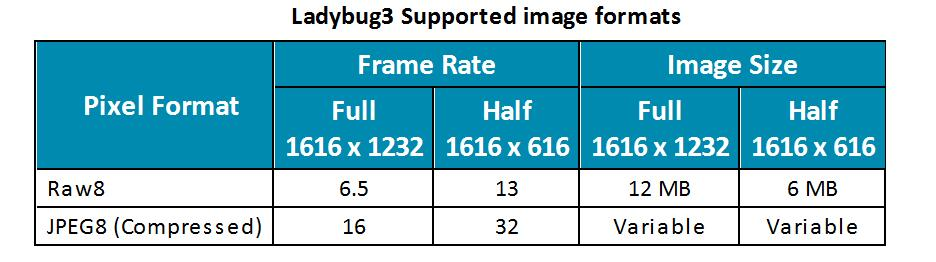

# Pointgrey Ladybug ROS Driver

This driver is an expansion of the Ladybug3 driver (https://github.com/rpng/pointgrey_ladybug)

Ladybug3相机的图像采集有两类模式，一类是采集原图，一类是采集压缩图像，采集原图方式消耗时间更多



## 文件目录

`src/pointgray_ladybug` : ladybug ROS驱动

`Ladybug SDK`：包含Linux SDK 和Windows SDK 

`Ladybug doc` ：一些ladybug的手册

## Installation

#### 1.安装Linux ladybug SDK

* `sudo apt-get install xsdcxx`
* Extract SDK to get deb file
* `sudo dpkg -i ladybug-1.16.3.48_amd64.deb`
* Open the /etc/default/grub file in any text editor. Find and replace:
  * `GRUB_CMDLINE_LINUX_DEFAULT="quiet splash"`
  * With:
  * `GRUB_CMDLINE_LINUX_DEFAULT="quiet splash usbcore.usbfs_memory_mb=4095"`(经过测试，这个值设置到4000以上才能正常工作，不同电脑不同，如果遇到帧率不正常，图片不全，可以试试增大这个值)
* `sudo update-grub`
* restart computer
* check that it is enabled: `cat /sys/module/usbcore/parameters/usbfs_memory_mb`

#### 2.编译ROS driver

#### 3.安装Windows ladybug SDK（可选）

打开`Ladybug_1.16.3.48_Windows_x64.exe`,直接安装

Windows SDK有GUI，有更多的功能，对应的功能也都有源码实现


## Mode 1: 采集原图

- 分辨为1616*1232时，频率最大为6.5Hz
- 例子：

```
$ roslaunch pointgrey_ladybug display_raw_data.launch 
```

- 输出图像方式：

发布话题

```
/ladybug/camera0/image_raw
/ladybug/camera1/image_raw
/ladybug/camera2/image_raw
/ladybug/camera3/image_raw
/ladybug/camera4/image_raw
/ladybug/camera5/image_raw
```


## Mode 2: 采集JPEG压缩结果

- 分辨为1616*1232时，频率最大为16Hz
- 例子：

```
$ roslaunch pointgrey_ladybug save_jpeg_data.launch  #运行之前要修改launch文件中的文件保存路径
```

- 输出图像方式：

保存为特定格式视频流文件(.pgr)，**注意不要更改视频流文件的名称**

```
ladybug_12193139_2020XXXX_XXXXXX-000000.pgr 
```

节点发布话题`/ladybug/imageInfo`, 消息类型为std_msgs::Header，包含每个image的id和采集图像时的ROS时间戳，如果想用采集图片时的ros时间戳，**录制数据集时可以把这个话题录进去**。不过相机采集时会带有世界时间戳，**我们使用的是这个时间戳**

数据采集完成之后，需要离线解压视频流文件为tiff格式文件

```
rosrun pointgrey_ladybug pgr2tiff pgrfileName outputDirectory
```


## TO DO

1. Mode 1，设法降低分辨率（参考），理论上会提高最大频率的限制
2. Mode 2，设法将jpeg压缩后的变量格式（ladybug SDK 自定义格式）转为sensor_msgs::image（我尝试了一些方法没有成功），说不定也可以将图片通过topic直接发出来
3. Mode 2，单线程下，如果边采集图像，边保存为bmg文件会消耗时间，16Hz会降到10Hz左右，如果改到多线程下边采集图像边保存为图像文件，应该可以解决这个问题，这样就不需要离线再操作一步了
4. Ladybug提供了一些格外的接口，比如去畸变图像，将6张图片合并到一张图上等等，这些接口在Windows驱动上可以直接看到，Linux上可以参考`ladybugProcessStream`这个Demo改一下（这个demo安装SDK后可以在`/usr/src/ladybug/src`找到）


## Uninstalling

* The package should be installed as a system package
* If you need to use other pointgrey drivers (that also use the libflycapture.so file)
* `sudo apt-get remove ladybug`


